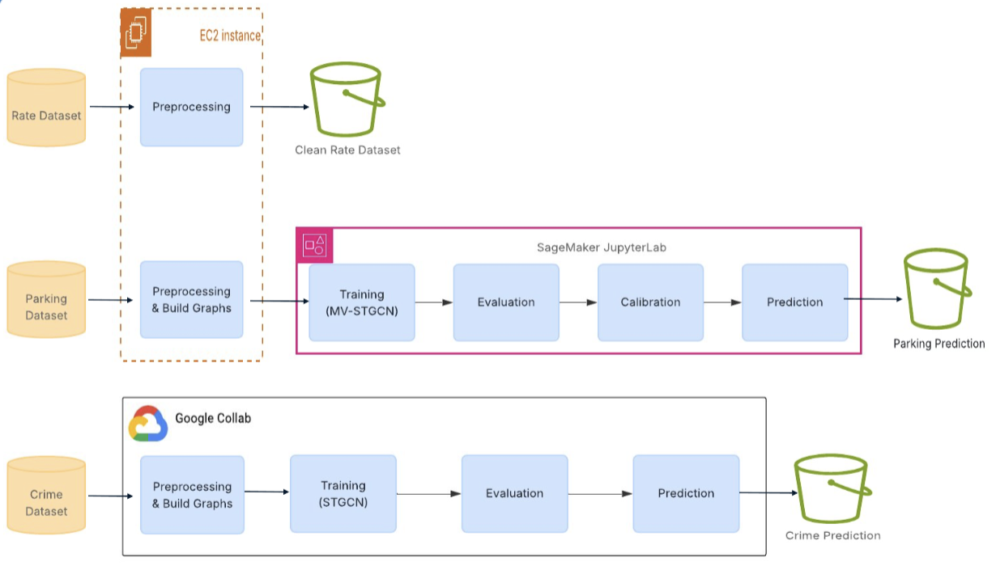
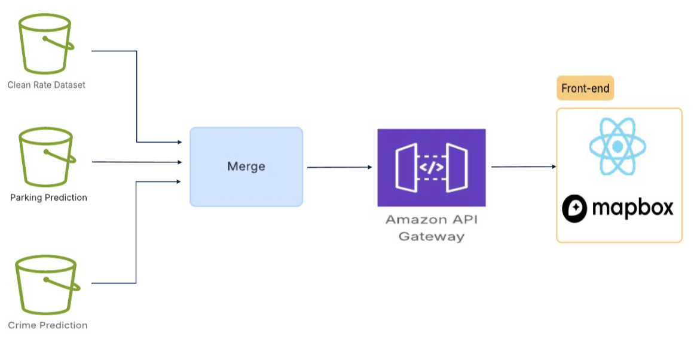

# 🚗 Smart Park Seattle

### Multi-Objective Spatiotemporal Graph Learning for Parking Availability & Crime Risk

An advanced **smart parking decision engine** that recommends optimal parking spots in Seattle by jointly considering **availability, safety (crime risk), cost, and walking distance**.

---

## 📌 Overview

Urban parking is a complex real-world problem where drivers must balance multiple factors such as **availability, safety, cost, and convenience**.

**Smart Park Seattle** solves this by:

* Predicting **short-term parking availability (15 & 30 minutes)**
* Estimating **localized crime risk**
* Ranking parking options based on **user preferences**

Unlike traditional navigation systems, this project delivers **personalized, data-driven parking recommendations**.

---

## 🧠 Key Contributions

* Multi-objective formulation of parking (availability + safety + cost + distance)
* Dual-model architecture using **Graph Neural Networks**
* Personalized recommendation engine with user-controlled trade-offs
* Built on large-scale real-world Seattle datasets

---

## 🏗️ System Architecture

```text
User Input (Destination + Preferences)
            │
            ▼
 ┌─────────────────────────────┐
 │ Data Processing Layer       │
 │ (Parking + Crime Data)      │
 └─────────────────────────────┘
            │
            ▼
 ┌─────────────────────────────┐
 │ Dual Prediction Models      │
 │                             │
 │ • MV-STGCN → Availability   │
 │ • ST-GNN   → Crime Risk     │
 └─────────────────────────────┘
            │
            ▼
 ┌─────────────────────────────┐
 │ Multi-Objective Ranking     │
 │ (Cost + Distance + Safety)  │
 └─────────────────────────────┘
            │
            ▼
   Top Parking Recommendations
```

---

## 🚀 Features

* 📍 Block-level parking recommendations
* ⏱️ Short-term forecasting (15/30 minutes)
* 🛡️ Crime-aware safety scoring
* 💰 Cost-aware ranking
* 🚶 Walkability optimization
* ⚙️ User preference controls (Safety vs Cost trade-off)

---

## 📊 Dataset

### 🅿️ Parking Data

* ~535 million records (2022–2023)
* Source: Seattle Department of Transportation (SDOT)

### 🚔 Crime Data

* ~1.2 million police reports (2018–2025)
* Source: Seattle Police Department (SPD)

---

## 🤖 Models & Methods

### 1. Parking Availability (MV-STGCN)

* Multi-view graph:

  * Physical connectivity
  * Parking behavior similarity
* Captures spatial + temporal dependencies

### 2. Crime Risk Prediction (ST-GNN)

* Graph-based spatial modeling
* Handles sparse and zero-inflated data
* Uses GCN + GRU architecture

### 3. Recommendation Engine

* Combines:

  * Availability probability
  * Risk score (Safe / Moderate / High)
  * Price + walking distance
* Outputs ranked parking suggestions

---

## 📈 Results

### Parking Prediction

* ROC-AUC: **0.980**
* PR-AUC: **0.986**

### Crime Risk Model

* MAE: **~0.80**
* RMSE: **~1.13**
* Recall: **99.95%** (high safety guarantee)

> ⚠️ The model prioritizes safety by creating buffer zones around high-risk areas.

---

## ⚙️ Tech Stack

* **Languages:** Python
* **Frameworks:** PyTorch
* **Data Processing:** Pandas, NumPy
* **Modeling:** Graph Neural Networks (GCN, ST-GNN)
* **APIs:** Mapbox

---


## Data Pipeline



---

## 📂 Project Structure

```bash
Smart-Park-Seattle/
│
├── .idea/                # IDE configuration files
├── crime/                # Crime risk modeling (ST-GNN, datasets, preprocessing)
├── frontend/             # Frontend UI (React / Web interface)
├── parking_ml/           # Parking availability models (MV-STGCN, training scripts)
├── .gitattributes        # Git LFS configuration for large datasets
└── README.md             # Project documentation
```

---

## 📁 Folder Details

### 🔹 crime/

* ST-GNN implementation
* Crime data preprocessing
* Risk prediction pipeline

### 🔹 parking_ml/

* MV-STGCN model
* Training & evaluation scripts
* Parking forecasting pipeline

### 🔹 frontend/

* User interface for:

  * Input destination
  * Viewing recommendations
  * Visualizing safety & availability
---

## 🔮 Future Work

* Real-time IoT parking sensor integration
* Improved ranking evaluation metrics
* Higher temporal resolution for crime prediction
* Full-stack deployment with live UI
* Personalized recommendation learning

---

## ⚠️ Disclaimer

* Crime predictions are **risk indicators**, not guarantees
* The system is designed to **assist decision-making**

---

## 👨‍💻 Team Credit

### Front-end
* Marlin Banh

### MV-STGCN:
* Marlin Banh
* Yunsung Choi

### ST-GNN:
* Nayan Makwana
* Samarth Tanwar

---

## ⭐ Why This Project Stands Out

* Combines **Graph Neural Networks + real-world city-scale data**
* Solves a **practical urban problem**
* Goes beyond prediction → **decision intelligence system**
* Strong focus on **real-world deployment and interpretability**

---
